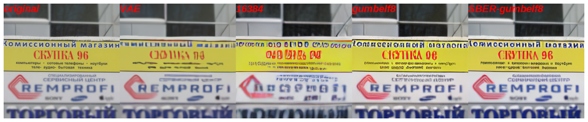

# SBER-VQ-GAN  

В данном репозитории содержится информация о модели VQ-GAN от SBER.  
Мы улучшили качество генерации изображений на некоторых доменах, таких как люди и текста.

<a href="https://static.wikia.nocookie.net/walkingdead/images/d/d9/%D0%90%D1%80%D0%BD%D0%BE%D0%BB%D1%8C%D0%B4_%D0%A8%D0%B2%D0%B0%D1%80%D1%86%D0%B5%D0%BD%D0%B5%D0%B3%D0%B3%D0%B5%D1%80.jpg/revision/latest/scale-to-width-down/700?cb=20170729224452&path-prefix=ru">original</a>

 

  
  
<a href="https://vyveski66.ru/userfiles/shop/slider/467_skupka-1.jpg">original</a>

  
 

  
  
<a href="https://i.ytimg.com/vi/yTrB1SnUYPc/maxresdefault.jpg">original</a>

 

## Модели и конфиги
<a href="https://drive.google.com/file/d/1COec-dpskvwHbIl9QA8qy_9nuOzsRLkl/view?usp=sharing">VAE encoder</a> - <a href="https://drive.google.com/file/d/1pCIvZnVrzA968dqSAi2OEj299Y9YLcDQ/view?usp=sharing">VAE decoder</a>  
<a href="https://drive.google.com/file/d/1yB5nPXiJqYnoBEOannq_M5JJ2lpzhp3T/view?usp=sharing">VQ-GAN 16384</a> - <a href="https://drive.google.com/file/d/1mXu9ThC3ET_uFGPwCYKCbOXqwma7wHo-/view?usp=sharing">Config 16384</a>  
<a href="https://drive.google.com/file/d/1UHuUUWX5F4y17oaW8sWuDzrsXyExU-rK/view?usp=sharing">VQ-GAN GUMBELF8</a> - <a href="https://drive.google.com/file/d/1M7RvSoiuKBwpF-98sScKng0lsZnwFebR/view?usp=sharing">Config GUMBELF8</a>  
<a href="https://drive.google.com/file/d/1WP6Li2Po8xYcQPGMpmaxIlI1yPB5lF5m/view?usp=sharing">SBER VQ-GAN GUMBELF8</a> - <a href="https://drive.google.com/file/d/1M7RvSoiuKBwpF-98sScKng0lsZnwFebR/view?usp=sharing">Config GUMBELF8</a>  

## Примеры
  
  

## Результаты рассчёта метрик  
### IS (Больше - лучше)
|domain/model | VAE | 16384 | gumbelf8 | SBER-gumbelf8| Original|
|:---|:---:|:---:|:---:|:---:|:---:|
|all | 11.133 | 13.647 | 15.203 | 15.316| 15.278|
|indoor | 9.769 | 10.744 | 11.707 | 11.688 | 11.638|
|kitchen | 9.726 | 11.354 | 12.333 | 12.152 | 11.813|
|appliance | 5.705 | 6.024 | 6.154 | 6.199 | 5.890|
|electronic | 7.830 | 9.509 | 9.712 | 9.606 | 9.497|
|furniture | 10.861 | 13.346 | 14.500 | 14.531 | 14.592|
|outdoor | 8.163 | 9.520 | 10.668 | 10.293 | 10.451|
|sports | 7.467 | 8.544 | 8.814 | 8.841 | 8.962|
|food | 7.954 | 8.725 | 9.390 | 9.434 | 9.191|
|vehicle | 10.527 | 12.947 | 14.240 | 14.559 | 14.233|
|animal | 11.933 | 14.249 | 15.999 | 15.879 | 15.857|
|accessory | 9.399 | 11.687 | 13.117 | 13.388 | 13.228|
|person | 13.752 | 17.794 | 20.048 | 20.420 | 20.600|
|face | 11.903 | 14.987 | 16.986 | 17.489 | 17.584|
|text | 14.902 | 18.457 | 21.396 | 21.292 | 21.131|

### FID (Меньше - лучше)
|domain/model | VAE | 16384 | gumbelf8 | SBER-gumbelf8|  
|:---|:---:|:---:|:---:|:---:| 
|all | 59.753 | 38.912 | 30.304 | 30.136 |  
|indoor | 74.734 | 57.925 | 45.432 | 44.686 |  
|kitchen | 66.424 | 47.086 | 36.735 | 36.579 |  
|appliance | 80.359 | 70.604 | 53.225 | 52.064 |  
|electronic | 77.856 | 64.034 | 50.759 | 50.447 |  
|furniture | 53.438 | 38.204 | 29.510 | 29.569 |  
|outdoor | 91.932 | 58.877 | 46.309 | 45.287 |  
|sports | 65.540 | 39.961 | 32.219 | 31.756 |  
|food | 76.974 | 53.109 | 41.018 | 41.413 |  
|vehicle | 60.318 | 34.259 | 26.721 | 26.463 |  
|animal | 64.250 | 41.520 | 32.039 | 32.078 |  
|accessory | 79.843 | 56.311 | 44.660 | 44.454 |  
|person | 40.810 | 20.430 | 15.523 | 15.484 |  
|face | 54.153 | 34.109 | 26.663 | 26.750 |  
|text | 47.299 | 27.656 | 21.303 | 21.148 |  

## Авторы
...  